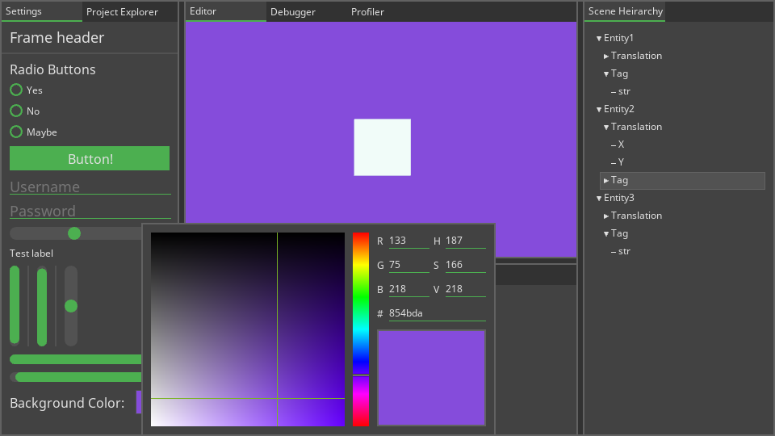

# Greet Engine on Linux
This is a game engine which is developed in C++ with OpenGL. This engine contains an in-house GUI system, linear algebra math and loads of abstraction of OpenGL object to ease the development of games.

The future goal of the project is to have a full blown game editor, like Unity or Godot, which is able to create games without interfacing with C++.

## GUI system
Demo image of the in-house GUI system, with radiobuttons, text-fields, treeview, color-pickers, tab-docking, and much more. The entire GUI is customizable using a layout file and a styling file, much like HTML and CSS. This demo can be found within `examples/GUIPlayground` where the layout and styling files are inside `res/gui` and `res/styling`. Note that this image might be out of date of the current state of the example. 


## Requirements
To run the engine a OpenGL shader version of 4.5 is required. If this version is not met, some rendering might only make use of a pink error shader.
Some functionality might work with versions below 4.5, but it is not guaranteed.

## Library Dependencies
This engine uses only four library dependencies to run.
These are [GLEW](http://glew.sourceforge.net/), [GLFW](https://www.glfw.org/), [FreeImage](https://freeimage.sourceforge.io/) and [FreeType](https://www.freetype.org/). How to install these on Ubuntu and Manjaro is show below, for other distros there might be similar packages within your package manager. Otherwise you might have to compile it from source from the links of the libraries given above.

### Ubuntu
Not entirely sure if these work anymore, was a long time since I used Ubuntu. But it atleast gives some hint of what is required.
```
  sudo add-apt-repository ppa:glasen/freetype2
  sudo apt update
  sudo apt install freetype2-demos libfreeimage3 libfreeimage-dev xorg-dev libglew-dev libglfw3-dev
```

### Manjaro 
```
  pamac install freeimage freetype2 glew glfw-x11
```

## Compiling
To compile it you also need to use an in-house build tool called [MakeGen](https://github.com/thraix/MakeGen).
To compile the engine you simply run `makegen` within the `Greet-core` folder.
To compile and run the example programs run `makegen run` within the example project folder, ie `examples/GUIPlayground`.